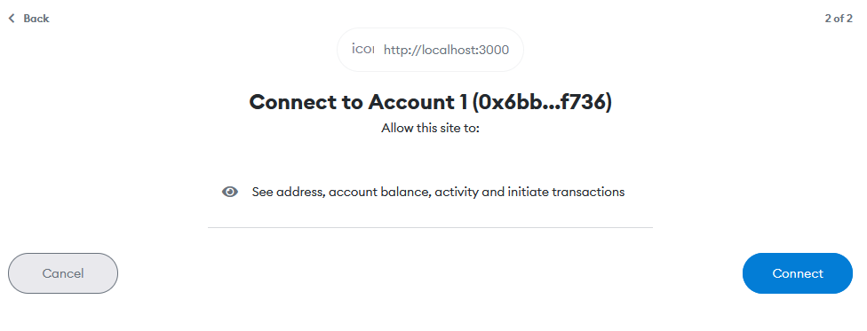

import {Form, ConnectAccountButton, SendEthButton, ERC20Handler, ERC721Handler} from "./components/baseComponents.tsx"


# Handing Metamask hands-on
In this post, I present how to handle Metamask on the web with interactive examples using React components.
I hope it is helpful to someone.

The purposes of this post are as follows:
- Show how to attach Metamask on the web 
- Show how to make a transaction using Metamask on the web
- Show how to deploy smart contract(minting coin) using Metamask on the web

This post is based on this [resource](https://docs.metamask.io/guide/create-dapp.html) of Metamask docs.

For all source code of this page, please visit [my github](https://github.com/HyoungsungKim/HyoungsungKim.github.io/tree/gh-pages/blog).

<!--truncate-->

## Dependincies
- [Metamask extension](https://metamask.io/download/)
- [Ethers.js](https://docs.ethers.io/v5/getting-started/#installing)

---

## Connect Metamask on Web
---
- In this subchapter, we show how to Connect Metamask.  

The web clients do not want to let the host store their private key of the Ethereum wallet. Namely, the host must Connect Ethereum provider for their service.
The Metamask is one of the most famous Ethereum providers, so I will present how to Connect the Metamask on the web as an Ethereum provider with interactive examples.

The Metamask provides how to [connect Metatmask and attach on the web](https://docs.metamask.io/guide/getting-started.html#basic-considerations). However, to fully utilize Metamask for smart contracts,
I will present how to connect using Etheres.js

The goal of this subchapter is to connect Metamask and show your address. If you clicked `Connect Metamask`, your Metamask would request connecting to this page.

<ConnectAccountButton display="Connect Metamask" className="button button--primary" />

Let's begin generating `Connenct Metamask` components like the above example.

First, we need to define connect class to connect Metamask using Etheres.js

```typescript title="connect.ts"
import { ethers } from 'ethers';

export class Connect {
    private provider: ethers.providers.Web3Provider;
    private signer: ethers.providers.JsonRpcSigner;

    constructor(externalProvider: ethers.providers.ExternalProvider) {
        this.provider = new ethers.providers.Web3Provider(externalProvider);
        this.signer = this.provider.getSigner();
    }

    getProvider(): ethers.providers.Web3Provider { 
        return this.provider;
    }

    getSigner(): ethers.providers.JsonRpcSigner {
        return this.signer
    }
}
```

There are two variables `provider` and `signer`. The `provider` denotes the Ethereum provider like Metamask.
If a client connects their Ethereum provider, such as Metamask, to the web, a host can get a client's information as knonwn as `signer`.


```typescript title="baseComponents.tsx"
import { Connect } from '../src/connect';

declare global {
    interface Window {
        ethereum: any;
    }
}

interface ButtonProps extends React.ButtonHTMLAttributes<HTMLButtonElement> {
    display: string;
}

let connect: Connect;
let provider: ethers.providers.Web3Provider;

function ConnectAccountButton(props: ButtonProps): JSX.Element {
    let {display, onClick, ...htmlButtonProps}: ButtonProps = props;
    
    let userAccountComponent: HTMLSpanElement;
    let userAccount: string;
    
    const clickHandler = async () => {
        connect = new Connect(window.ethereum);
        provider = connect.getProvider();

        await provider.send("eth_requestAccounts", []);
        const signer = connect.getSigner();
        userAccount = await signer.getAddress();
        userAccountComponent = document.getElementById("userAccount") as HTMLSpanElement;
        userAccountComponent.textContent = `User account: ${userAccount}`;

        console.log("Account:", userAccount);
    }

    return (
        <div>
            <button {...htmlButtonProps} onClick={clickHandler}>{display}</button>
            <div>
                <span id="userAccount">{`User account: `}</span>
            </div>
        </div>
    )
}

```
(***I just defined `ButtonProps` to use the Button component easily in mdx file. Thus, you don't need to use it for your usage***)

In above code, we need to note the `clickHandler` callback function. By this function, we can connect Metamask on the web.

```typescript
connect = new Connect(window.ethereum);
provider = connect.getProvider();

await provider.send("eth_requestAccounts", []);
```

We need to initialize the `Connect` class first using `window.ethereum`. This process lets Ethers.js know which provider will be used for the Ethereum provider.

We have installed Metamask as a browser extension as dependencies, so `window.ethereum` denotes that Metamask will be used as Ethereum provider.

After finishing connect, we can call Ethereum [JSON-RPC API](https://eth.wiki/json-rpc/API) and [Metamask API](https://docs.metamask.io/guide/rpc-api.html#ethereum-json-rpc-methods).

Thus, by using the `eth_requestAccounts`, we can request permission to connect your Metamask 

If the provider succeeded in calling the `eth_requestAccounts` API, we would see the below popup, which requests permission.



After connection, we can get an address of a client using signer, which is derived by the provider.
```typescript
const signer = connect.getSigner();
userAccount = await signer.getAddress();
```

Finally, we succeeded in connecting Metamask on the web!

## Send ETH to account
---
0.0001 ETH = 5AF3107A4000 WEI

<SendEthButton display="Send Ethereum" className="button button--primary" />

## Smart contract
---

- ERC-20
- ERC-721
- ERC-1155

### ERC-20
- Deploy smart contract to mint ERC20 token
- Send ERC20 token to other account

#### Contract
```solidity title="erc20.sol"
//SPDX-License-Identifier: Unlicense
pragma solidity ^0.8.0;

import "@openzeppelin/contracts/token/ERC20/ERC20.sol";

contract Minting is ERC20 {
    constructor(
        uint256 totalSupply_,
        string memory name_,
        string memory symbol_) ERC20(name_, symbol_) {
        _mint(msg.sender, totalSupply_);
    }
}
```

<ERC20Handler className="button button--primary" />

### ERC-721
- Deploy smart contract
- Mint ERC721 token using metadata

#### Contract
```solidity title="erc721.sol"
// SPDX-License-Identifier: MIT
pragma solidity ^0.8.0;

import "@openzeppelin/contracts/token/ERC721/extensions/ERC721URIStorage.sol";
import "@openzeppelin/contracts/utils/Counters.sol";

contract MyNFT is ERC721URIStorage {
    using Counters for Counters.Counter;
    Counters.Counter private _tokenIds;

    constructor(string memory _name, string memory _symbol) ERC721(_name, _symbol) {}

    function mintNFT(address _to, string memory _tokenURI) public returns (uint256) {
        _tokenIds.increment();

        uint256 newNFTId = _tokenIds.current();
        _mint(_to, newNFTId);
        _setTokenURI(newNFTId, _tokenURI);

        emit Transfer(msg.sender, _to, newNFTId);

        return newNFTId;
    }
    
    function tokenURI(uint256 tokenId) public view override (ERC721URIStorage) returns (string memory) {
        return super.tokenURI(tokenId);
    }

    function _burn(uint256 tokenId) internal override (ERC721URIStorage) {
        super._burn(tokenId);
    }
}
```
<ERC721Handler className="button button--primary" />

